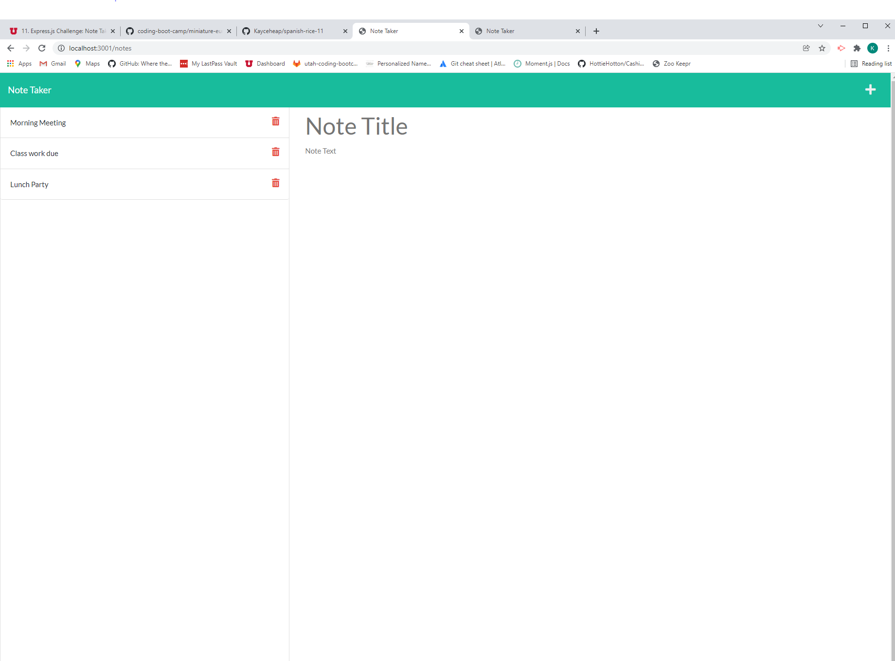

# spanish-rice-11

This application is used for note taking, helping you remember tasks on your todo list, or just there to help you take quick notes while in a meeting. You can save your notes and delete unwanted ones!

<a href="https://github.com/Kayceheap/spanish-rice-11">Week 11 Challenge on github</a>

</img>

<a href="https://sheltered-wave-47329.herokuapp.com/notes">Note taker on heroku</a>